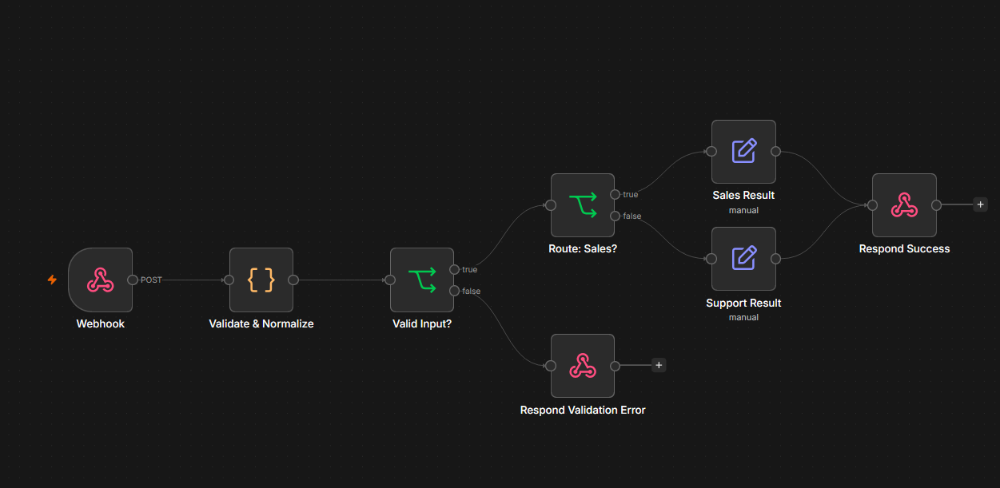

# n8n Client Lead Intake Automation

A portfolio n8n automation lab for structured client lead intake: input validation, a sales/support routing decision, and a JSON HTTP response.

> Disclosure: This is a simulated/internal automation lab using synthetic data. It was built and tested locally. It is not paid client work and is not a production deployment.

## Overview

This project demonstrates how a client lead intake workflow can be automated using n8n.

The workflow accepts structured lead data over a webhook, validates and normalizes the payload, decides whether the lead is routed to sales or support, and returns a JSON HTTP response (200 for accepted leads, 400 with validation errors). It does not write files or call downstream systems.

The purpose of this repository is to demonstrate practical automation engineering capability with defensible evidence, documentation, synthetic test data, and a public-safe workflow export.
## Workflow Overview



The workflow demonstrates:

- webhook-based lead intake
- validation and normalization
- explicit validation branching
- sales/support routing
- structured success response
- validation error handling


## What this demonstrates

- n8n workflow engineering
- webhook-based intake design
- structured lead processing
- validation and normalization
- conditional routing
- synthetic test data
- test evidence
- public-safe workflow packaging
- documentation suitable for handoff or portfolio review

## Architecture

See:

- docs/ARCHITECTURE.md
- docs/CASE_STUDY.md
- docs/TESTING.md
- docs/SECURITY_AND_PRIVACY.md
- docs/LIMITATIONS.md

## Repository structure

workflow/
  client-lead-intake.public.json

docs/
  ARCHITECTURE.md
  CASE_STUDY.md
  TESTING.md
  SECURITY_AND_PRIVACY.md
  LIMITATIONS.md

examples/
  synthetic-data/      request payloads and expected responses

scripts/
  verify-local.sh      local reproduction against n8n 2.36.9

evidence/
  public/

screenshots/

## Evidence

Public evidence is stored separately from the original internal lab evidence.

The source workflow and original evidence remain preserved outside this public repository.

Included public evidence:

- test results reproduced by `scripts/verify-local.sh` (evidence/public/TEST_RESULTS.source.md)
- public-safe review notes (evidence/public/PUBLIC_SAFE_REVIEW.source.md)
- historical test-log screenshot from the original lab run (screenshots/test-evidence-preview.png): a manually maintained evidence workbook that summarises that run's results. It is not workflow-generated output (the workflow writes no files); its inputs and HTTP status codes match the reproduced scenarios

## Public-safe design

This repository intentionally excludes:

- real credentials
- real client data
- private API keys
- access tokens
- client secrets
- production endpoints
- paid-client claims
- production deployment claims

Synthetic data is used for public demonstration.

## Workflow

Public-safe workflow export:

workflow/client-lead-intake.public.json

After import and publish, the workflow accepts `POST /webhook/client-lead-intake-v1` with a JSON body containing `name`, `email`, `department` (`sales` or `support`), and optional `inquiry` and `phone`. It responds with JSON only:

- valid sales lead: HTTP 200 `{"status":"qualified","team":"sales","message":"Synthetic lead accepted and routed to Sales."}`
- valid support lead: HTTP 200 `{"status":"received","team":"support","message":"Synthetic lead accepted and routed to Support."}`
- invalid input: HTTP 400 `{"ok":false,"errors":[...]}`

It does not write files or call external systems.

The workflow should be reviewed and configured with environment-specific credentials and endpoints before any real deployment.

## Testing

The underlying automation lab reached:

PASS WITH DISCLOSURE / PORTFOLIO-READY

Testing evidence is documented in:

docs/TESTING.md

To reproduce locally (requires Docker and curl; synthetic data only):

```
./scripts/verify-local.sh
```

## Portfolio positioning

This project should be described as:

Simulated/internal automation lab using synthetic data; built and tested locally.

It should not be represented as:

- paid client work
- a live customer deployment
- production usage
- a proven revenue outcome
- a production SLA

## Author

ZUHAYR SYSTEMS

Automation Engineering - APIs - n8n - Workflow Systems

